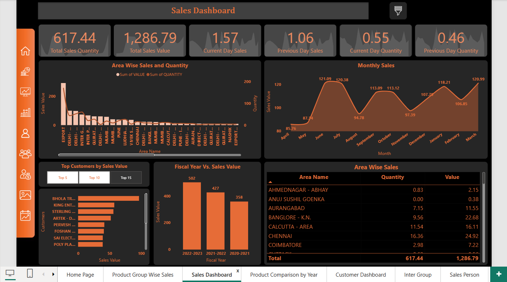

# **Sales and Customer Analytics Dashboard for a Manufacturing and Exports Company**

## **Project Overview**

This project uses Power BI to analyze sales performance and customer behavior for a manufacturing and exports company. The dashboard provides insights into revenue trends, customer segmentation, product performance, and regional exports to support data-driven business decisions.

## **Dashboard Overview**

## **Dataset Information**

The dataset used in this project is a Manufacturing and Export Sales dataset in CSV format. The original dataset (36 MB) contains complete sales records for multiple financial years.

To comply with GitHub file size best practices, a reduced sample dataset (10,000 rows) has been included in this repository for demonstration purposes.

The complete dataset can be accessed using the link below:

🔗 [Download Full Dataset](https://docs.google.com/spreadsheets/d/1z4rGlfQTF0tFEN9wDq1D5ChcubtzvX6w/edit?usp=drive_link&ouid=110641820183776195289&rtpof=true&sd=true)

## **Tools & Technologies Used**

- Power BI
- Power Query Editor (Data Cleaning & Transformation)
- DAX (Calculated Measures & KPIs)
- Microsoft Excel (Data Source)

## **Key Insights**

- Achieved consistent year-over-year sales growth from FY 2020–21 to FY 2022–23.

- Identified Finished Goods and Raw Materials as major revenue contributors.

- Detected clear seasonal sales trends, with peak performance in early fiscal months.

- Found that a small group of top customers contributes a significant share of total revenue.

- Analyzed region-wise and export sales performance to identify high-performing markets.

- Enabled KPI-based monitoring for sales, quantity, and salesperson performance using Power BI.
